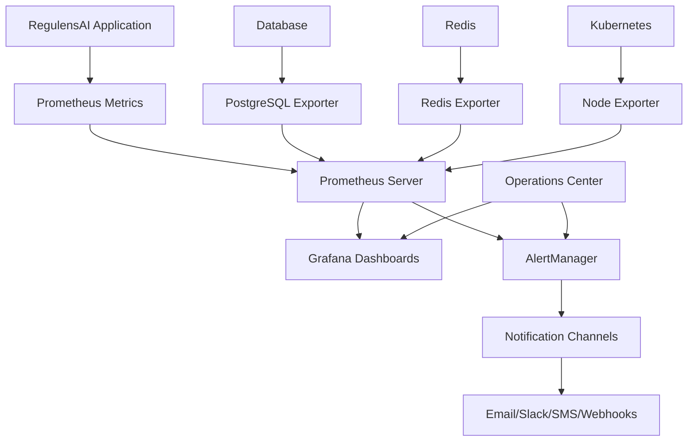

# RegulensAI Advanced Monitoring and Alerting Guide

## 🎯 Overview

The RegulensAI Advanced Monitoring System provides comprehensive real-time visibility into system health, performance metrics, and business KPIs with intelligent alerting capabilities. This enterprise-grade monitoring solution ensures proactive issue detection and rapid incident response.

## 🏗️ Architecture

### Core Components



### Monitoring Stack
- **Prometheus**: Metrics collection and storage
- **Grafana**: Visualization and dashboards
- **AlertManager**: Intelligent alerting and routing
- **Custom Exporters**: Application-specific metrics
- **Operations Center**: Integrated monitoring interface

## 📊 Dashboard Overview

### 1. Executive Overview Dashboard

**Purpose**: High-level business metrics for executives and stakeholders

**Key Metrics**:
- System Health Score (0-100%)
- Compliance Score (regulatory adherence)
- Active Users (24h rolling)
- System Uptime (99.9% SLA target)
- Compliance Task Status (pie chart)
- Training Completion Rate
- API Response Time (95th percentile)
- Business Metrics Trend (time series)

**Access**: `https://grafana.regulens.ai/d/executive-overview`

### 2. Technical Operations Dashboard

**Purpose**: Infrastructure monitoring for DevOps and technical teams

**Key Metrics**:
- CPU Usage (per instance)
- Memory Usage (per instance)
- Database Connections (active vs max)
- Database Query Performance
- Redis Performance (commands/sec, clients)
- API Request Rate (by method/status)
- API Error Rate (5xx responses)
- Kubernetes Pod Status
- Disk Usage (gauge with thresholds)
- Network I/O (bytes/sec)

**Access**: `https://grafana.regulens.ai/d/technical-operations`

### 3. RegulensAI Application Dashboard

**Purpose**: Application-specific business logic monitoring

**Key Metrics**:
- User Authentication (logins/failures)
- Training Portal Usage (starts/completions/assessments)
- Compliance Task Metrics (by status)
- API Endpoint Performance (by endpoint)
- Database Query Performance (by table)
- Regulatory Document Processing
- AI Service Usage (OpenAI/Claude/Embeddings)
- Cache Hit Rates
- Background Job Queue
- User Session Duration

**Access**: `https://grafana.regulens.ai/d/regulensai-application`

### 4. Alerting Overview Dashboard

**Purpose**: Real-time alert management and incident response

**Key Metrics**:
- Active Alerts by Severity
- Alert Resolution Time
- Alert Frequency (24h)
- Critical/Warning/Info Alerts (tables)
- Business Impact Alerts
- Alert Escalation Status
- Notification Channel Status
- Mean Time to Detection (MTTD)
- Mean Time to Resolution (MTTR)
- Alert Correlation Map

**Access**: `https://grafana.regulens.ai/d/alerting-overview`

## 🚨 Intelligent Alerting System

### Alert Severity Levels

#### Critical Alerts
- **Service Down**: RegulensAI API unavailable
- **Database Failure**: Connection failures > 10/2min
- **Compliance SLA Breach**: >5 overdue tasks
- **High API Error Rate**: >5% error rate for 3min
- **Security Incidents**: Detected security breaches
- **Regulatory Deadline Missed**: Missed compliance deadlines

#### Warning Alerts
- **High Resource Usage**: CPU >80%, Memory >85%
- **Slow API Response**: 95th percentile >2s
- **Low Training Completion**: <70% completion rate
- **Database Slow Queries**: Average >1s for 10min
- **Predictive Alerts**: Trend-based early warnings

#### Info Alerts
- **High User Activity**: >10 registrations/hour
- **Compliance Tasks Due**: Tasks due within 24h
- **Backup Completed**: Successful backup notifications

### Escalation Paths

```yaml
Critical Alerts:
  - Immediate: DevOps On-call (email + Slack)
  - Business Critical: Executive Team (email + Slack)
  - Security: Security Team + CISO (email + Slack + webhook)

Warning Alerts:
  - Standard: DevOps Team (Slack)
  - Business: Compliance Team (email + Slack)
  - Proactive: Proactive Monitoring Channel (Slack)

Info Alerts:
  - Notification: Info Channel (Slack)
```

### Smart Alert Correlation

**Inhibition Rules**:
- Warning alerts suppressed when critical alerts active
- Database alerts suppressed when service is down
- Performance alerts suppressed during infrastructure issues

**Grouping**:
- Alerts grouped by service, instance, and severity
- Batch notifications to reduce noise
- Intelligent routing based on alert metadata

## 🔧 Custom Metrics

### Business Metrics

```python
# User Activity
user_logins_total = Counter('regulensai_user_logins_total')
user_login_failures_total = Counter('regulensai_user_login_failures_total')

# Compliance
compliance_score = Gauge('regulensai_compliance_score')
compliance_tasks_overdue = Gauge('regulensai_compliance_tasks_overdue')

# Training
training_completion_rate = Gauge('regulensai_training_completion_rate')
training_certifications_expiring_7d = Gauge('regulensai_training_certifications_expiring_7d')
```

### System Health Metrics

```python
# Database
db_connections_active = Gauge('regulensai_db_connections_active')
db_query_duration_seconds = Histogram('regulensai_db_query_duration_seconds')

# Cache
cache_hits_total = Counter('regulensai_cache_hits_total')
cache_misses_total = Counter('regulensai_cache_misses_total')

# AI Services
openai_requests_total = Counter('regulensai_openai_requests_total')
claude_requests_total = Counter('regulensai_claude_requests_total')
```

## 🚀 Deployment

### Quick Start

```bash
# Clone monitoring configuration
git clone https://github.com/regulensai/monitoring-config.git
cd monitoring-config

# Set environment variables
export GRAFANA_ADMIN_PASSWORD="your-secure-password"
export SLACK_WEBHOOK_URL="https://hooks.slack.com/services/YOUR/SLACK/WEBHOOK"
export SMTP_USERNAME="alerts@regulens.ai"
export SMTP_PASSWORD="your-smtp-password"

# Deploy monitoring stack
chmod +x monitoring/deploy-monitoring.sh
./monitoring/deploy-monitoring.sh
```

### Manual Deployment

```bash
# Create namespace
kubectl create namespace regulensai-monitoring

# Deploy Prometheus
helm install prometheus prometheus-community/kube-prometheus-stack \
  --namespace regulensai-monitoring \
  --set grafana.adminPassword="admin123"

# Deploy custom dashboards
kubectl create configmap grafana-dashboards \
  --from-file=monitoring/dashboards/ \
  --namespace=regulensai-monitoring

# Deploy alert rules
kubectl create configmap prometheus-rules \
  --from-file=monitoring/alerts/ \
  --namespace=regulensai-monitoring
```

## 🌐 Operations Center Integration

### Monitoring Tab Features

**Real-time Metrics**:
- Active alerts count with severity breakdown
- Business metrics summary (compliance, training, users)
- Quick access to all dashboards
- Alert acknowledgment interface

**Dashboard Access**:
- One-click dashboard opening
- Embedded dashboard previews
- Direct Grafana links
- Mobile-responsive interface

**Alert Management**:
- Active alerts list with details
- Alert acknowledgment functionality
- Escalation status tracking
- Historical alert data

### API Endpoints

```bash
# Get business metrics
GET /api/v1/operations/metrics/business

# Get active alerts
GET /api/v1/operations/alerts/active

# Acknowledge alert
POST /api/v1/operations/alerts/{alert_id}/acknowledge

# Get Prometheus metrics
GET /api/v1/operations/metrics/prometheus
```

## 📈 Performance Optimization

### Database Monitoring

**Optimized Queries**:
```sql
-- Compliance metrics (indexed on status, created_at)
SELECT status, COUNT(*) FROM compliance_tasks 
WHERE created_at >= NOW() - INTERVAL '30 days'
GROUP BY status;

-- Training completion (indexed on enrollment_id, completion_percentage)
SELECT AVG(completion_percentage) FROM training_progress
WHERE updated_at >= NOW() - INTERVAL '7 days';
```

**Index Recommendations**:
```sql
-- Performance indexes for monitoring queries
CREATE INDEX idx_compliance_tasks_status_created ON compliance_tasks(status, created_at);
CREATE INDEX idx_training_progress_completion ON training_progress(completion_percentage, updated_at);
CREATE INDEX idx_audit_logs_action_created ON audit_logs(action, created_at);
```

### Metrics Collection Optimization

**Collection Intervals**:
- Business metrics: 30 seconds
- System metrics: 15 seconds
- Database metrics: 30 seconds
- Alert evaluation: 15 seconds

**Resource Usage**:
- Prometheus: 2 CPU, 4GB RAM, 50GB storage
- Grafana: 1 CPU, 2GB RAM, 10GB storage
- AlertManager: 0.5 CPU, 1GB RAM

## 🔒 Security and Compliance

### Access Control

**Role-Based Permissions**:
```yaml
operations.monitoring.read:
  - View dashboards and metrics
  - Access alert information
  - Read-only Operations Center access

operations.monitoring.write:
  - Acknowledge alerts
  - Modify dashboard settings
  - Manage notification channels

operations.monitoring.admin:
  - Full monitoring configuration
  - Alert rule management
  - System administration
```

### Data Retention

**Metrics Retention**:
- Raw metrics: 15 days
- 5-minute aggregates: 90 days
- 1-hour aggregates: 1 year
- Daily aggregates: 5 years

**Alert History**:
- Active alerts: Real-time
- Resolved alerts: 90 days
- Alert statistics: 1 year

### Compliance Features

**Audit Logging**:
- All monitoring access logged
- Alert acknowledgments tracked
- Configuration changes audited
- Data access compliance (SOC 2)

**Data Privacy**:
- PII data excluded from metrics
- Secure metric transmission (TLS)
- Access control enforcement
- Data anonymization options

## 🆘 Troubleshooting

### Common Issues

**Dashboard Not Loading**:
```bash
# Check Grafana pod status
kubectl get pods -n regulensai-monitoring -l app.kubernetes.io/name=grafana

# Check Grafana logs
kubectl logs -n regulensai-monitoring deployment/prometheus-grafana

# Restart Grafana
kubectl rollout restart deployment/prometheus-grafana -n regulensai-monitoring
```

**Alerts Not Firing**:
```bash
# Check Prometheus targets
curl http://localhost:9090/api/v1/targets

# Check alert rules
curl http://localhost:9090/api/v1/rules

# Check AlertManager status
curl http://localhost:9093/api/v1/status
```

**Missing Metrics**:
```bash
# Check RegulensAI metrics endpoint
curl http://localhost:8000/api/v1/operations/metrics/prometheus

# Verify Prometheus scraping
kubectl logs -n regulensai-monitoring deployment/prometheus-server
```

### Support Contacts

- **Technical Issues**: devops@regulens.ai
- **Business Metrics**: compliance@regulens.ai
- **Emergency**: +1-555-REGULENS
- **Documentation**: docs.regulens.ai/monitoring

---

**Last Updated**: January 29, 2024  
**Version**: 2.0.0  
**Maintainer**: DevOps Team <devops@regulens.ai>
